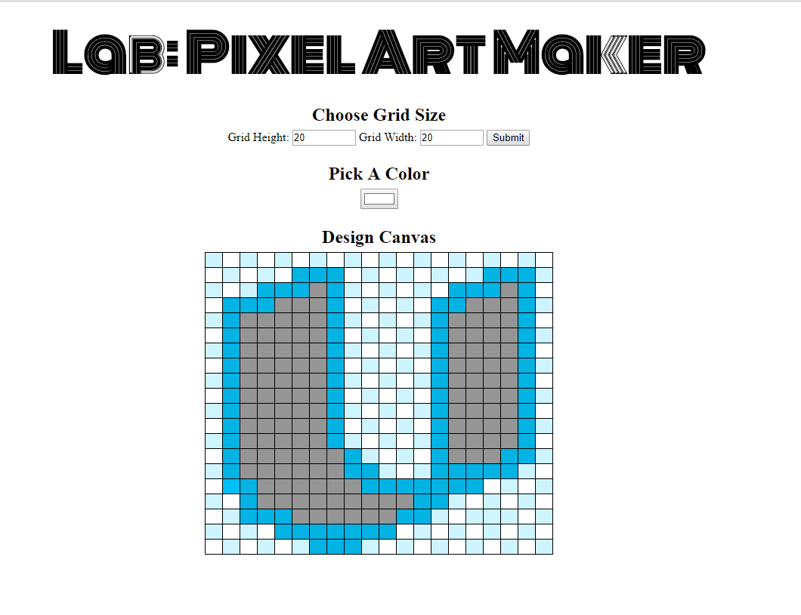

# Pixel Art Maker Project
---

## Project Purpose:

This game was built for the Google Africa Challenge Scholarship: Udacity Front-End  Program. The purpose of the project is to demonstrate understanding of JavaScript and HTML  event listeners by building a single-page web app that allows users to draw pixel art on a customizable canvas.

## How to Load the App
You can run a hosted version of the app at [https://korexma.github.io/korexma.github.io-UdacityPixelArtMaker/](https://korexma.github.io/korexma.github.io-UdacityPixelArtMaker/)

To run a local copy, clone or download the code repository at[https://Korexma.github.io/Udacity-Pixel-Art-Maker/](https://Korexma.github.io/Udacity-Pixel-Art-Maker/).   If downloaded, unzip the folder and run `index.html` in your favorite browser.

## How to Use the App
1. Set the canvas size using the width and height input selects boxes.  When finished, click on submit.
2. Choose a color from the color picker input box.
3. Click on any box in the grid to change that boxes color.
4. Repeat steps 2 and 3 until your design is complete.

Have fun!

### Resources and Documentation:
* [MDN > `<input type="color">`](https://developer.mozilla.org/en-US/docs/Web/HTML/Element/input/color)
* [MDN > `EventTarget.addEventListener()`](https://developer.mozilla.org/en-US/docs/Web/API/EventTarget/addEventListener)

### Udacity Resources:
* [Udacity JavaScript Basics Course](https://www.udacity.com/course/javascript-basics--ud804)
* [Project Overview](https://classroom.udacity.com/courses/ud304-africa/lessons/e36fd33e-774c-4f31-a935-5e41bc8d57a6/concepts/95f8afaa-020a-47e9-bfdb-911c8cdbcb4a)
* [Starter Code](https://github.com/udacity/project-pixel-art-maker-starter)
* [Project Rubric](https://review.udacity.com/#!/rubrics/641/view)
